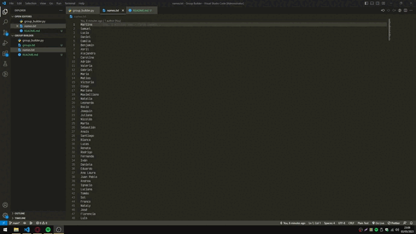

# Hi! Welcome to this repo!

### It's a simple program wich generates random groups based in a ``names.txt`` file and an user option, and the groups will be saved in the ``groups.txt`` file

The user can select:
* The group size
* The number of groups

### Preview: 
